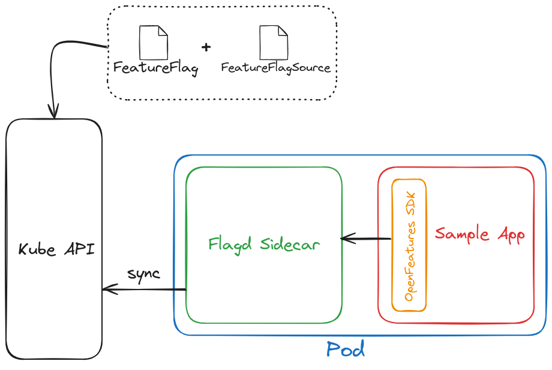

# OpenFeature Sample Application

This repository contains a sample Go application that uses the OpenFeature Operator [^ofp] with the Flagd provider [^fdp], and the OpenFeature Go SDK [^ofgs] to check the state of a feature flag.

## Overview

The application is a simple service that shows which inference mode is activated. By default, the `boring mode` is activated, however if the feature flag `instructlab_mode` is enabled, then the service will return that this is the currently supported mode. 

It uses the OpenFeature operator and Flagd to manage and evaluate feature flags.



### What is OpenFeature?

OpenFeature is an open standard for feature flag management. It provides a unified API and SDKs to interact with different feature flagging solutions, making it easier to integrate feature flags into your application.

### What is Flagd?

Flagd is a feature flag evaluation engine. Think of it as a ready-made, open source, OpenFeature-compliant feature flag backend system. We will use Flagd as a feature flag provider in this example. 

### What is an OpenFeature Provider?

Providers are responsible for performing flag evaluations. They provide an abstraction between the underlying flag management system and the OpenFeature SDK. Providers can wrap a vendor SDK, call a bespoke flag evaluation REST API, or even parse some locally stored file to resolve flag values. This allows the underlying flag evaluation logic to be changed without requiring a major code refactor.

### What is OpenFeature Operator?
The OpenFeature operator is an operator for managing feature flags that can be evaluated by any application in the cluster. It leverages Custom Resource Definitions (CRDs) to define the feature flags, their possible values, and the sources they will be evaluated from. And it injects sidecars into your application pods to receive the feature flag evaluation requests and communicate with the feature flag source.

### Sidecar
The OpenFeature Operator injects flagd as a sidecar that runs alongside your application in the same pods. It receives  the feature flag evaluation requests from the application and determine the state of each flag based on the configured feature flag sources. This approach decouples the application logic from the feature flag management, allowing for easier updates and management of feature flags.

### FeatureFlag CRD
The FeatureFlag Custom Resource Definition (CRD) defines the feature flags within your Kubernetes cluster. It allows you to specify feature flag configurations directly in your Kubernetes manifests. A FeatureFlag resource might include details such as the flag key, default value, and targeting rules.

Here's an example of a FeatureFlag CRD:

```yaml
apiVersion: core.openfeature.dev/v1beta1
kind: FeatureFlag
metadata:
  name: odh-flags
spec:
  flagSpec:
    flags:
      instructlab_mode:
        state: "ENABLED" # The default state of the flag. States managed the state of the flag itself regardless of its value. E.g. a "DefaultCurrency" flag can have a state of "ENABLED" and a value of "USD". 
        variants: # The possible values for the flag. Here if the value is enabled, the flag value is ture, and if the value is disabled, the flag value is false. 
          "enabled": true
          "disabled": false
        defaultVariant: "enabled"
        targeting: {}
```

### FeatureFlagSource CRD
The FeatureFlagSource Custom Resource Definition (CRD) specifies the source of the feature flags. This could be an external service like Flagd or any other feature flag management tool. In our case, the `FeatureFlag` CRD will be our source (it's called a kuberenetes source). It also specifies the port on which the sidecar will listen for flag evaluation requests among other things.

Here's an example of a FeatureFlagSource CRD:

```yaml
apiVersion: core.openfeature.dev/v1beta1
kind: FeatureFlagSource
metadata:
  name: feature-flag-source
spec:
  sources:
  - source: flags/odh-flags # The namespace/name of the FeatureFlag resource
    provider: kubernetes
  port: 8080 # The port on which the sidecar will listen for flag evaluation requests
```

## Building and Running the Sample Application

TBD

[^ofp]: https://github.com/open-feature/open-feature-operator/
[^fdp]: https://flagd.dev/
[^ofgs]: https://flagd.dev/providers/go/

